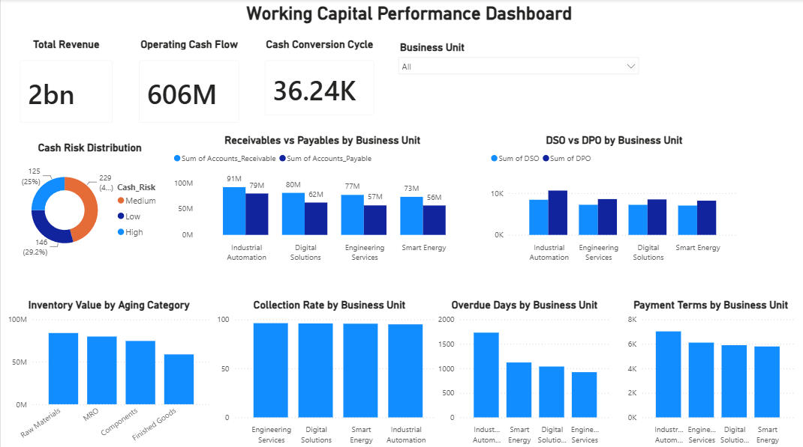

# Working Capital Performance Dashboard

### Power BI | Financial Analytics | Business Intelligence

**Created by Tanvi Kamat**

---

##  Project Overview

The **Working Capital Performance Dashboard** is an interactive Power BI dashboard designed to analyze working capital, cash-flow efficiency, and financial performance across different business units.

The dashboard provides a consolidated view of receivables, payables, inventory, collections, payment terms, overdue days, and cash-risk indicators to support data-driven financial and operational decision-making.

---

##  Business Objective

The objective of this project is to analyze key working capital metrics and identify areas that may impact cash-flow efficiency and financial performance.

The dashboard helps stakeholders:

- Monitor Accounts Receivable and Accounts Payable
- Analyze cash conversion efficiency
- Compare DSO and DPO across business units
- Track collection performance
- Identify overdue payments
- Analyze inventory aging
- Evaluate payment terms
- Monitor cash-risk distribution

---

##  Tools & Technologies

- **Power BI**
- **Microsoft Excel**
- **Power Query**
- **DAX**
- **Data Cleaning & Transformation**
- **Data Visualization**
- **Financial & KPI Analysis**

---

##  Key KPIs

- Total Revenue
- Operating Cash Flow
- Cash Conversion Cycle
- Days Sales Outstanding (DSO)
- Days Payable Outstanding (DPO)
- Collection Rate
- Overdue Days
- Payment Terms
- Inventory Value
- Cash Risk

---

## Dashboard Analysis

### Working Capital Analysis
- Receivables vs Payables by Business Unit
- DSO vs DPO by Business Unit
- Cash Conversion Cycle

### Cash & Collection Analysis
- Cash Risk Distribution
- Collection Rate by Business Unit
- Overdue Days by Business Unit
- Payment Terms by Business Unit

### Inventory Analysis
- Inventory Value by Aging Category
- Raw Materials
- MRO
- Components
- Finished Goods

### Interactive Analysis

A **Business Unit filter** allows users to dynamically analyze working capital performance across individual business units.

---

##  Key Insights

- Receivables are higher than payables across the analyzed business units.
- Industrial Automation records the highest receivables and payables.
- Collection rates remain consistently high across business units.
- Industrial Automation has the highest overdue days.
- Industrial Automation also shows the highest payment terms.
- Raw Materials represent the highest inventory value among the analyzed aging categories.
- DSO and DPO provide useful indicators of cash conversion efficiency.

---

##  Dashboard Preview

---

##  Project Files

| File | Description |
|------|-------------|
| `Working_Capital_Performance_Dashboard.pbix` | Power BI dashboard |
| `Working_Capital_Cash_Flow_Data.xlsx` | Source dataset |
| `Working_Capital_Performance_Dashboard.png` | Dashboard preview |

---

##  Skills Demonstrated

- Financial Data Analysis
- Working Capital Analysis
- Data Cleaning
- Data Transformation
- Power Query
- DAX
- Power BI Dashboard Development
- KPI Analysis
- Business Intelligence
- Data Visualization
- Financial Reporting

---

###  Author

**Tanvi Kamat**

Mechanical Engineering Graduate | Data Analytics & Business Intelligence
